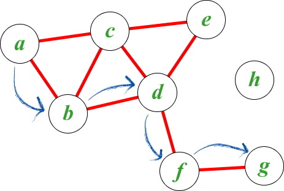

<!--

The paper.md, bibtex and figure file can be found in this repo:

  https://github.com/journal-of-research-objects/Example-BioHackrXiv-Paper

To modify, please clone the repo. You can generate PDF of the paper by
pasting above link (or yours) in

  http://biohackrxiv.genenetwork.org/

-->

# Introduction

Logic programming in the form of relational SQL queries on database
tables and SPARQL queries on semantic web graph data stores, is
well known to many bioinformaticians. More advanced logic programming,
however, is underutilized in bioinformatics.  Prolog, for example, is
a high-level programming language that has its roots in first-order
logic or first-order predicate calculus.  Another example, miniKanren, is an embedded
Domain Specific Language for logic programming. Core miniKanren is
exceptionally simple, with only three logical
operators and one interface operator [@reasoned2nd].

The introduction of logic programming is particularly relevant in the
context of multi-model data representations where data can be accessed
in memory as free data structures, but also on disk where data can be
represented as tables, trees (documents), and graphs. In
bioinformatics we can make use of all these different data sources and
have a query engine that can mine them all efficiently.

Logic programming is well-suited for biological research. Essentially, a
researcher writes a number of statements that include variables representing unknown information.  The logic
engine then goes through the solution space (all data) to find possible
matches (see figure \ref{fig}). Much more detail on the rationale and
implementations of miniKanren and logic programming are well
summarized in Byrd's book \emph{The Reasoned Schemer, Second Edition} [@reasoned2nd],
PhD thesis [@ByrdPhD], and [online](https://www.youtube.com/watch?v=eQL48qYDwp4) [talks](https://www.youtube.com/watch?v=o3AHnyEf7IE).

The `Logic Programming' working group at the 2019 edition of the
annual Japanese BioHackathon applied logic programming to various problems.
The working group:
\begin{itemize}
\item researched state-of-the-art mapping between graph stores;
\item created methods for bridging between SPARQL and in-memory data representations using Prolog;
\item extended the Biolink model;
\item and added Relational Biolink type inference for mediKanren.
\end{itemize}

<!--
# Results
-->

## Existing logic programming facilities for SPARQL

We researched current solutions for combining logic programming with
SPARQL.
[ClioPatria](http://www.semantic-web-journal.net/system/files/swj1074.pdf)
is an in-memory RDF quad-store tightly coupled with SWI-Prolog by Jan
Wielemaker, the main author of SWI-Prolog [@WielemakerBHO15]. SWI-Prolog
is published under a BSD license, and there even exist bindings for
[ClioPatria and Python](http://wi.hwtk.de/WLP2018/Papers/WLP_2018_paper_4.pdf),
for example, although we were unable to locate the source code. We think ClioPatria and
SWI-Prolog are particularly useful for teaching, and for (in-memory)
semantic web applications. SWI-Prolog comes with client libraries for
SQL and SPARQL queries.

## Application of SPARQLProg to biological databases

<!--
    State the problem you worked on
    Give the state-of-the art/plan
    Describe what you have done/results starting with The working group created...
    Write a conclusion
    Write up any future work
-->

A number of biological databases make their data available in
RDF format, supporting SPARQL access---for example,
[Uniprot](https://www.uniprot.org/),
[NCBI Pubchem](https://pubchemdocs.ncbi.nlm.nih.gov/rdf) and the
[EBI RDF platform](https://www.ebi.ac.uk/rdf/). Complicated SPARQL
queries are required to effectively extract and combine information from multiple RDF
databases. Composing complex SPARQL queries is tedious and error-prone due to
the lack of abstract modularized structure in SPARQL. Thus, high-level
programming methodology on the basis of SPARQL endpoints is desirable.  Here, we realize high-level programming by using Chris Mungall's
[SPARQLProg](https://github.com/cmungall/sparqlprog)
to compose query building blocks; SPARQLProg
wraps access to existing SPARQL endpoints in the form of Prolog
code. The examples we developed include programs accessing RDF databases of MBGD [@Uchiyama:2019], KEGG OC,
TogoVar, JCM, Allie, EBI BioSamples, UniProt, and DisGeNET. Future
work includes using these Prolog codes as building blocks for
integrative analysis. SPARQLProg is written in
SWI-Prolog and has a Python interface library. All code has been made
available in the example directory of
[SparqlProg](https://github.com/cmungall/sparqlprog) which provides
sophisticated mapping of logic queries to SPARQL.

## Extending the BioLink Model

<!--
    State the problem you worked on
    Give the state-of-the art/plan
    Describe what you have done/results starting with The working group created...
    Write a conclusion
    Write up any future work
-->

The [BioLink Model](https://github.com/biolink/biolink-model) is a
data model developed for representing biological and biomedical
knowledge. It includes a schema and generated objects for the
data model and upper ontology. The BioLink Model was designed with the goal of
standardizing the way information is represented in a graph store,
regardless of the formalism used. The working group focused on
extending this model to support representation of a wide variety of
knowledge.

The following tasks were accomplished as part of the BioHackathon:

\begin{enumerate}
\item represent datasets, and their related metadata;
\item represent family and pedigree information, to support clinical knowledge;
\item and make the provenance model more rich and descriptive.
\end{enumerate}

For future work, the group will ensure that the new classes added to
the model will have appropriate mappings to other schemas and
ontologies.

##  Relational Biolink type inference for mediKanren

<!--
    State the problem you worked on
    Give the state-of-the art/plan
    Describe what you have done/results starting with The working group created...
    Write a conclusion
    Write up any future work

* Remote member Nada Amin, Chris Mungall, Deepak Unni, Will Byrd

-->

* Goal: implement a relational type inferencer for the Biolink model in miniKanren, which can be integrated into mediKanren

* Nada added a `yaml` subdirectory to the mediKanren GitHub page, and created multiple files:

https://github.com/webyrd/mediKanren

** `yaml2sexp.py` generates the `biolink.scm` file, which contains an s-expression version of the Biolink yaml file

** `yaml.scm` contains miniKanren relations, and Chez Scheme code that generates miniKanren relations based on `biolink.scm` (basically these are giant `conde` clauses that can be though of as relational tables);  `yaml.scm` also contains tests for the relations.

Chris and Deepak are guiding us wrt the Biolink semantics

Future work

* integrate into the Racket mediKanren code

* integrate with the data categories in the KGs

* create query editor with decent type error messages, autocomplete, query synthesis, etc.

# Discussion

The working group concluded that there is ample scope for logic
programming in bioinformatics. Future work inludes expansion of
accessing semantic web databases using SPARQLProg, expanding
the BioLink model, and adding dynamic SPARQL support to miniKanren.

# References
