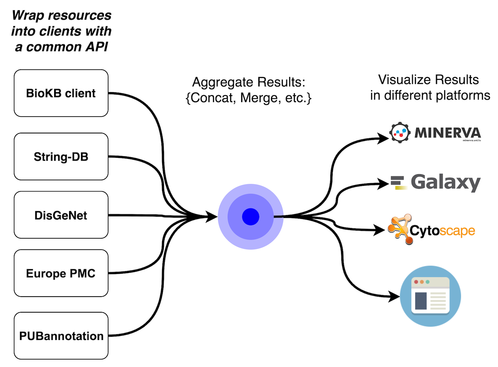

# Introduction

The tremendous growth of scientific publications [1] provides challenges for researchers and curators for finding and assimilating scientific conclusions described in the literature. 
To this end, text mining pipelines facilitate the extraction of scientific assertions together with their biological context. 
This process comprises of several challenging tasks such as part-of-speech tagging, entity normalisation, or event extraction, which are essential to discover relevant knowledge in the form of entities, relations and events. 
During this biohackathon project, we focused on further integration, interoperability and accessibility of different text-mining knowledge repositories with well-defined APIs to facilitate construction of gene/protein networks and disease maps and annotation of bio-entities, relationships and events within these networks and maps.

The outcome of this project is twofold. On one side it will help curators and researchers improve they knowledge pipelines through a common-inter-resource API, browsing information [BioKB], annotating interactions [BioKC] and constructing disease map models [Minerva]. On the other side it will also feedback each of the constituent resources which will benefit from this open and collaborative integration process. To this end, the very first step of the project was to study the capabilities of these resources in terms of content and interoperability and note their assets and handicaps. The last european Biohackathon in Paris provided us a priviledged stand to undertake the project in company with field experts. 

## Proposal

The outcome of the project must be open and available for the community to use and extend. Hence, we propose to work on the construction of several resource wrappers aiming for a common API to easily query multiple text-mining resources at once. 
Finding a common interface between the resources is one of the most challenging aspects of this project, but once found we can easily build a continuous integration pipeline to ensure further additions will adhere to the common API. As an example, BioKB already implements a client to communicate with its triple store that is already wrapped. This could serve as a template for developing other wrappers.

## Available Resources

Hereafter we tackle some of the particularities of some of the most important knowledge bases available. 
For the sake of brevity we also summarised them in the following table.

|                 | Aim                                                                                                                                                                         | Size                                                          |
|---------------- |---------------------------------------------------------------------------------------------------------------------------------------------------------------------------- |-------------------------------------------------------------- |
| BioKB           | Helps researchers easily  access semantic content  of thousands of abstracts  and full text articles.                                                                       | 24M abstracts 5.3 full text articles                          |
| String-DB       | Known and predicted  protein-protein  interactions.                                                                                                                         | 9.6M proteins  from 2K organisms.                             |
| PMC  Europe     | Provides text mining  annotations contained  in abstracts and open access full text articles                                                                                | 36.2M abstracts 5.7 articles                                  |
| DisGeNET        | Discovery platform for  genes and variants  associated to human  diseases                                                                                                   | 628K GDAs 210K VDAs 62M triples                               |
| Pub Annotation  | Repository of  text annotations                                                                                                                                             | 12M articles                                                  |
| Pub CaseFinder  | Phenotype-driven  differential diagnosis  system                                                                                                                            | 7K Genetic Diseases 4.6K Rare Diseases  from 2M Case Reports  |
| HiPathia        | Web tool for the  interpretation of the  consequences of the  combined changes of gene  expression levels and/or  genomic mutations in the context of signalling  pathways  |                                                               |

During this hackathon we decided to start working with three of these resources, namely, STRING-DB, BioKB and PMC Europe, as we could benefit from the participation of experts from these resources.

### STRING-DB

STRING is a database of known and predicted protein-protein interactions. The interactions include direct (physical) and indirect (functional) associations; they stem from computational prediction, from knowledge transfer between organisms, and from interactions aggregated from other (primary) databases. String-DB api can be found at https://string-db.org/help/api/ .

### BioKB

BioKB platform, features a pipeline which, which by exploiting text mining and semantic technologies, helps researchers easily access semantic content of thousands of abstracts and full text articles. The text mining component analyzes the articles content and extracts relations between a wide variety of concepts, extending the scope from proteins, chemicals and pathologies to biological processes and molecular functions. Extracted knowledge is stored in a knowledge base publicly available for both, human and machine access, via this web application and SPARQL endpoint. BioKB API is described at https://core-services.pages.uni.lu/biokb-web/api/index.html#tag/BioKB-Resources .

### PMC Europe

Europe PMC is an open science platform that enables access to a worldwide collection of life science publications and preprints from trusted sources around the globe. Europe PMC covers over 5 million more abstracts than PubMed and also contains Patents, NHS (National Health Service) guidelines, and Agricola records. Its API is described in https://europepmc.org/AnnotationsApi .

Finally, we benefited from the presence of leading experts in some of the above-mentioned Knowledge Bases (Europe PMC, String, and BioKB) and started to design and develop a common interface for a modest set of operations.
Namely, *getMentions* and *getCoOccurrences*. The former refers to the operation of finding those publications in which a given group of entities are mentioned, whilst the latter finds a group of entities that co-appear together with a given entity. 

# Methodology

As proof of concept we built a simple website to query and visualize the results. The granularity of the information retrieved from this resource hub has at least two levels. First, at the global level it allows for relationship/co-occurrence seeking. Second, some resources provide information per relationship/co-occurrence that serve as evidence for model annotation.
For the sake of ensuring good maintainability, each wrapper could also implement a set of unit tests, so in case any of these resources changes its internal API, maintainers will be warned. To ensure interoperability, this API will be able to aggregate the results and provide a response in JSON, XML and RDF. One good use case for the outcome of this work includes the future integration of such multi-resource module into BioKB to improve its browsing and annotation capabilities. 

There are different drill stages for the browsing workflow. A user may begin with either an Entity; two Entities; or two Entities + a verb (the relationship). From that point the API provides different annotation granularities. Namely, for a single Entity; for a particular correlation of two entities; or for a particular relationship between two entities.

Below there is one example for each resource of these methods for the different resources used.

**Get Entity Co-occurrences for Entity** 
For example, give me every other entity related to Asthma.
- In BioKB, would be https://biokb.lcsb.uni.lu/entity/DOID:2841 which shows everything related to Asthma.
- The same in BioKB but only those that are Proteins https://biokb.lcsb.uni.lu/entity/DOID:2841?co-occurrences_type=Protein
- In PMC Europe: https://www.ebi.ac.uk/europepmc/annotations_api/annotationsByEntity?entity=asthma&filter=1&format=JSON&pageSize=4
- Jensenlab: http://api.jensenlab.org/Textmining?type1=-26&id1=DOID:10652&type2=9606&limit=10&format=json

**Get Entity Relationship for Entity**
This one adds a verb to the previous method. For example, give me every entity that {regulates, increases, decreases} Asthma. 
- BioKB https://biokb.lcsb.uni.lu/relationship/GO:0016301-phosphorylatesProtein-GO:0038024
- PMC Europe: https://www.ebi.ac.uk/europepmc/annotations_api/annotationsByRelationship?firstEntity=asthma&secondEntity=obesity&filter=1&format=JSON&pageSize=4

# Results and outlook

Despite of the short development time, the outcomes of the project are promising. A first API draft was defined and deployed, with https://biokb.lcsb.uni.lu/tmh as the API endpoint. API details and documentation can be found on https://core-services.pages.uni.lu/biokb-web/api/index.html#tag/TM-Hub . As a proof of concept we deployed the multi resource hub server as well as a small web site to interact with the common API, allowing the user to perform the aforementioned operations included in the common interface.

## Use cases

Potential use cases include the integration of multiple resources into current knowledge bases, such as BioKB, or the construction of disease maps or biological networks.

Importantly, a parallel project in BioHackathon'19 focused on "Disease and pathway maps for Rare Diseases" incorporated our outcomes into their workflow. However, since most of the text mining interactions are non-directional, they had to complement the results of our text-mining hub with OmniPath information.

## Issues

The main issues and bottlenecks for a smooth resource interoperability were identified. Hereafter we describe the main issues found. Firstly, the very definitions of relationship, co-occurrence and other terms vary from one resource to another. Hence, the first task was to unify the terminology for the API.

Even though **Europe PMC** API is very well designed, the backend response was too slow for a interoperative work. It would be extremely useful to have a faster response and bigger responses because the annotation information is very well detailed. This slowness compromised the response of the common API and hence the getCoccurrence operation for this resource was disregarded. Same for multiple entity call to GetMentions operation. Right now only single entity query is supported for GetMentions operation. It also requires text based queries instead of ontology entity codes. For example asthma instead of DOID:2841.

**BioKB** also needed some performance fixes to speed up the query response. At the moment of writing, a second triple store was deployed to improve the performance of the SPARQL queries. Also, an additional reflect instance was deployed to help on the entity tagging task. Several API requests are now cached to offer faster response.

In order to normalise the different entity types we agreed to use reflect types, available at https://bitbucket.org/larsjuhljensen/tagger/src/default/ . The code must be improved so that each resource provides its own entity and entity_type translator, if needed. Pagination must also be implemented in order to browse all results. And explanation field in the response could increase result interpretability.

## Outlook

The main idea of the project was successfully proven, although several issues and technical bootlenecks must be addressed in order to have an operative service. We strongly think that movements towards an unified API must be done to increase resource interoperability. We look forward to working with more institutions in order to improve and extend the current resource hub.

# Acknowledgements

This work was done during the The BioHackathon Europe, organised and funded by the ELIXIR Hub in November 2019 in Paris. We thank the organizers for an opportunity to participate in such a productive and collaborative event, and for accomodation. We thank colleagues from the "Disease and pathway maps for Rare Diseases" project for integrating the outcomes of this project.

References

# References

[1] - Bornmann, L., & Mutz, R. (2015). Growth rates of modern science: A bibliometric analysis based on the number of publications and cited references. Journal of the Association for Information Science and Technology, 66(11), 2215-2222. https://doi.org/10.1002/asi.23329

[] - The UniProt Consortium, UniProt: a worldwide hub of protein knowledge, Nucleic Acids Research, Volume 47, Issue D1, 08 January 2019, Pages D506–D515, https://doi.org/10.1093/nar/gky1049

[BioKB] - Biryukov, M., Groues, V., Satagopam, V., & Schneider, R. (2018). BioKB-Text Mining and Semantic Technologies for Biomedical Content Discovery.

[String] - Szklarczyk, D., Morris, J. H., Cook, H., Kuhn, M., Wyder, S., Simonovic, M., ... & Jensen, L. J. (2016). The STRING database in 2017: quality-controlled protein–protein association networks, made broadly accessible. Nucleic acids research, gkw937. https://doi.org/10.1093/nar/gkw937

[Minerva] - Gawron, P., Ostaszewski, M., Satagopam, V., Gebel, S., Mazein, A., Kuzma, M., ... & Schneider, R. (2016). MINERVA—a platform for visualization and curation of molecular interaction networks. NPJ Systems Biology and Applications, 2, 16020. https://doi.org/10.1038/npjsba.2016.20

[ePMC] - Levchenko, M., Gou, Y., Graef, F., Hamelers, A., Huang, Z., Ide-Smith, M., ... & Marinos, N. (2017). Europe PMC in 2017. Nucleic acids research, 46(D1), D1254-D1260. https://doi.org/10.1093/nar/gkx1005
